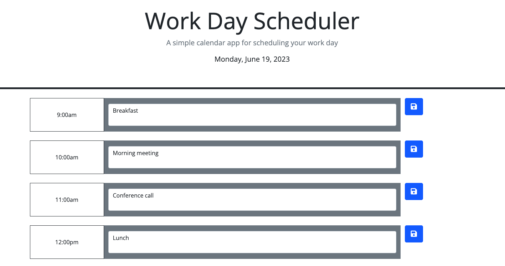

# DailyPlanner
Daily Planner made for 2023 CU Bootcapm

The daily planner made for this challenge allows a user to open the web page in their browser, add and save events to local storage and retrieve them later. The time slots are also color coded to show past, present and future timeblocks. The timeblocks are for business hours and the current date is displayed above.

Screenshot:  

Deployed link: https://beerendan.github.io/DailyPlanner/